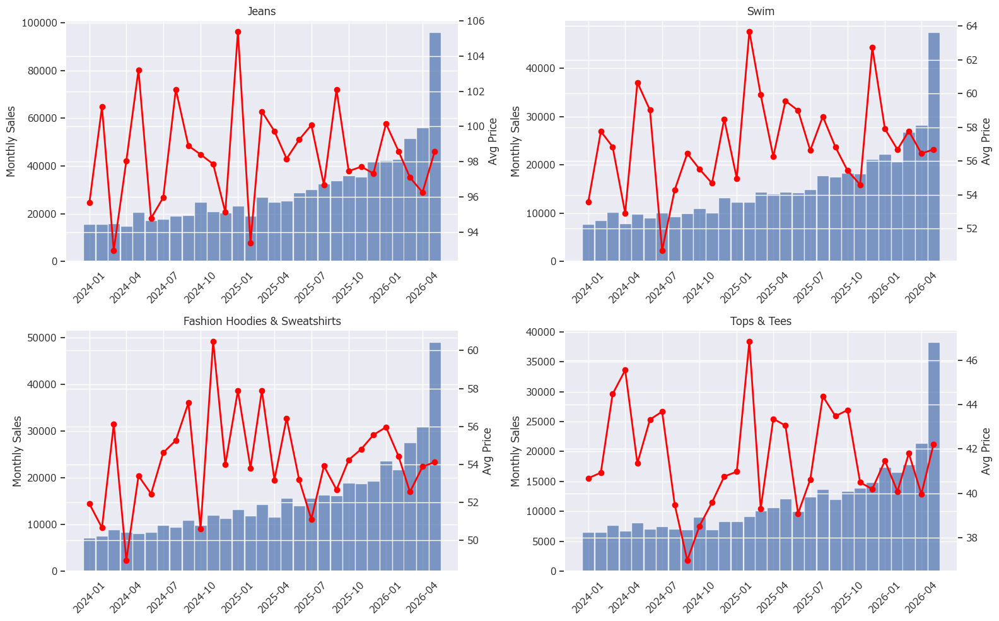
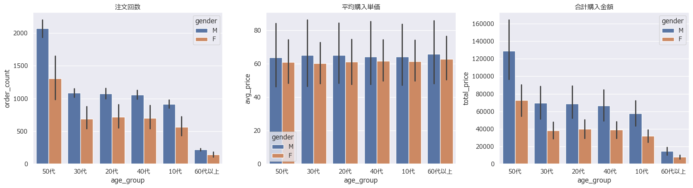
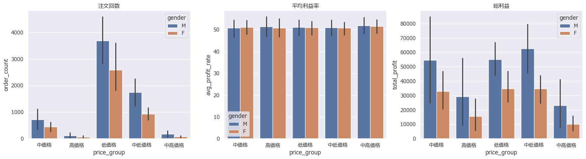

# E-commerce Sales Analysis

## 概要

ECサイトの購買データを顧客行動や商品カテゴリ別の売上傾向を分析し、売上向上施策を提案した。

## 分析目的

売上を左右する要因を特定し、優良顧客の特徴や利益率の高い商品カテゴリを明らかにすることで、売上向上につながる施策を検討する。

## 使用技術

* SQL (BigQuery)
* Python
* pandas
* matplotlib
* seaborn

## 分析内容

* カテゴリ別利益分析

* 時系列分析

* ユーザー分析

* 価格帯分析

  
* 改善提案
  
## 主な分析結果

* 50代ユーザーの売上貢献度が高い
* 女性ユーザーは購入カテゴリ数が多い
* 低価格帯商品の注文数が多い
* 季節による売上変動が見られた

## 改善提案

1. 低価格商品の拡充
2. 季節需要に合わせた商品展開
3. 高単価アクセサリーの強化

## ファイル

* sale_price_anarytics.ipynb
