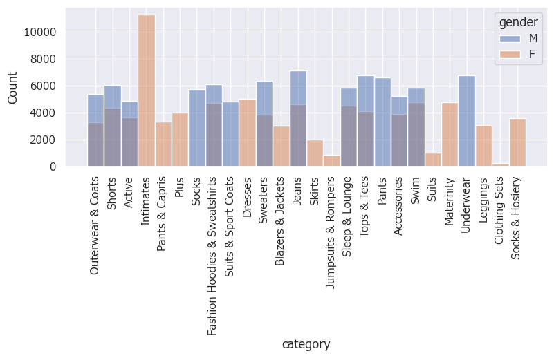
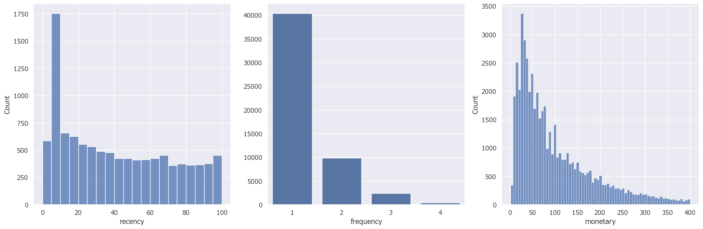
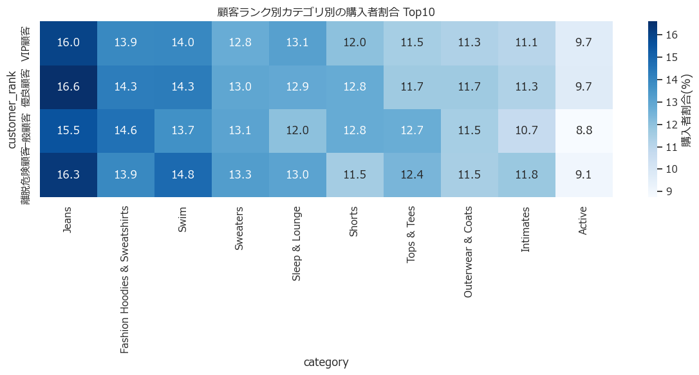
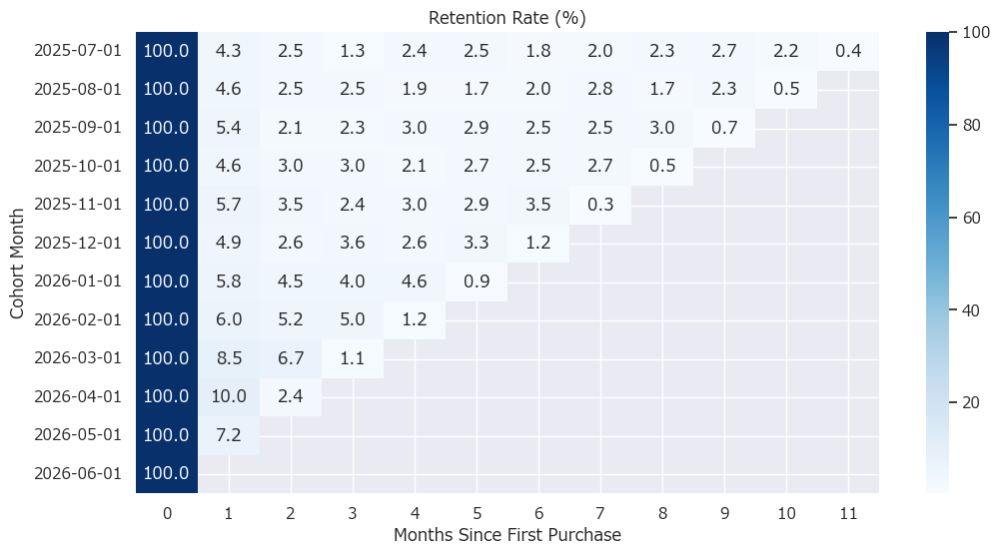

## 自己紹介

東京電機大学3年　若林　岳人

データアナリストを目指しており、SQLやPythonを用いたデータ分析を学習しています。
顧客分析やマーケティング分析に興味があり、データから課題を発見し改善策を提案することを目標にしています。

---
## 目次
- Skills
- Projects
---

## 💻Skills
- SQL
- Python
- Pandas
- BigQuery
- Matplotlib
- Seaborn
---
## 📜Projects
## ECサイト利益向上のための顧客分析
コード: ecommerce_analysis.ipynb
### 目標
ECサイトの利益向上につながる顧客行動を分析し、施策を提案する。
### 説明
BigQuery Public Datasetのthelook_ecommerceを使用し、顧客分析を実施した。
### 分析フロー
デモグラフィックの確認
→
EDA
→
RFM
→
コホート
→
施策提案

---

### EDA分析
男女で購入しているカテゴリの種類に違いが見られた。

カテゴリ別購入数

---

### RFM分析
初回購入のみの顧客が76.1%いることが分かった。その中でもVIP顧客は一人当たりの利益が優良顧客の2倍にもなる。

RFMの三要素確認

顧客ランクごとの購入カテゴリ

---

### コホート分析

約90%の顧客が1ヶ月以内に離脱していた。2ヶ月目以降でのリピート率に大きな減少はなかった

年代別離脱率の確認

---

### 結果
VIP顧客は1人あたり利益が高い一方で、優良顧客からVIP顧客への育成余地が大きいことが分かった。また、約90%の顧客が1ヶ月以内に離脱しており、初回購入後の定着施策が重要であることが判明した。

